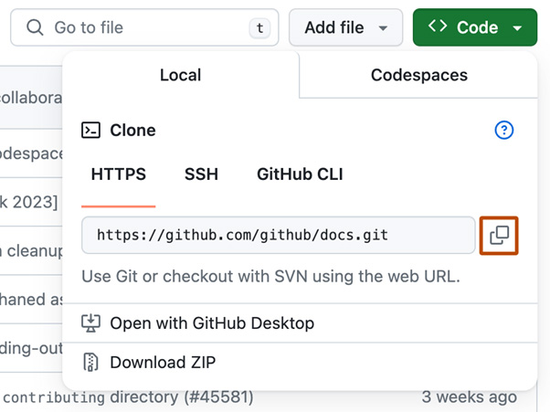

# Task 1 Repository Setup

## Step 1: Log in to your GitHub account

1.Open your web browser and go to GitHub.
2.Click on "Sign in" in the top-right corner.
3.Enter your GitHub username and password, then click "Sign in."

## Step 2: Create a new repository

1.Once logged in, click the "+" icon in the top-right corner of the page.
2.Select "New repository" from the dropdown menu.

## Step 3: Configure your new repository

1.You will be redirected to the "Create a new repository" page.
2.In the "Repository name" field, enter PLPBasicGitAssignment.
3.Optionally, add a description for your repository in the "Description" field.
4.Select the visibility of your repository:

- Public: Anyone on the internet can see your repository.
- Private: You choose who can see and commit to this repository.

5.Check the box that says "Initialize this repository with a README."

## Step 4: Create the repository

1.Click the "Create repository" button at the bottom of the page.
Your new repository PLPBasicGitAssignment is now created and initialized with a README file.

## Task 2 Local Setup

### Create a new folder on your local machine

- Open File Explorer.
- Navigate to the location where you want to create the folder.
- Right-click in the directory, select "New," and then click "Folder."
- Name the folder PLPBasicGitAssignment.

### Git Initialization

1.Open a terminal or command prompt:

- Ensure you have already navigated to your local folder PLPBasicGitAssignment (from the previous steps).

#### Initialize a new Git repository

- Run the following command in your terminal or command prompt:
_git init_

#### Detailed Steps

- Open a terminal or command prompt:
- Press Win + R, type cmd, and press Enter to open Command Prompt.
- Use the cd command to navigate to your folder:
_cd path\to\your\PLPBasicGitAssignment_

#### Connecting to GitHub

To link your local repository to the GitHub repository you created, follow these steps:
1.Copy the URL of your GitHub repository:

- Navigate to your PLPBasicGitAssignment repository on GitHub.
- Click the "Code" button.
- Copy the URL from the HTTPS tab. It should look something like _<https://github.com/YourUsername/PLPBasicGitAssignment.git>_

2.Open a terminal or command prompt:

- Ensure you are still in the local folder PLPBasicGitAssignment.
3.Link your local repository to the GitHub repository:
- Use the git remote add origin command followed by the copied URL.
_Run the following command_
git remote add origin _<https://github.com/YourUsername/PLPBasicGitAssignment.git>_

4.Detailed Steps

- Copy the URL of your GitHub repository:
- Go to your repository on GitHub.
- Click the "Code" button and copy the URL.

- Open a terminal or command prompt:
- Press Win + R, type cmd, and press Enter to open Command Prompt.
- Ensure you are in your local folder:
_cd path\to\your\PLPBasicGitAssignment_

## Task 3: Making Changes

### Step 5: Create a File on Windows

1.Create a new text file

- Open File Explorer and navigate to your local folder PLPBasicGitAssignment.
- Right-click inside the folder, select "New," and then click "Text Document."
- Name the new file hello.txt.

2.Add a simple text message

- Double-click hello.txt to open it in Notepad.
- Type the following message:
_Hello, Git!_
- Save the file by clicking "File" > "Save" or pressing Ctrl + S.
- Close Notepad.

### Visual Steps

1.Create a new text file:

- Navigate to your folder
- Right-click to create a new text document
- Name the file hello.txt

2.Add a simple text message:

- Open hello.txt in Notepad
- Type "Hello, Git!" and save the file

By following these steps, you will have successfully created a file named hello.txt in your local folder and added a simple text message to it.

### Step 6 Committing Changes

1.Open a terminal or command prompt:

- Ensure you are in your local folder PLPBasicGitAssignment.

2.Stage the changes:

- Run the following command to stage the hello.txt file:
_git add hello.txt_

3.Commit the changes:

- Run the following command to commit the changes with a message:
_git commit -m "Add hello.txt with a greeting"_

__Detailed Steps__

1.Open a terminal or command prompt:

- Press Win + R, type cmd, and press Enter to open Command Prompt.
- Use the cd command to navigate to your local folder:
_cd path\to\your\PLPBasicGitAssignment_
Example:
_cd C:\Users\YourUsername\Documents\PLPBasicGitAssignment._

## Task 4: Pushing to GitHub

### Step 7: Push the committed changes to your GitHub repository

1.Open a terminal or command prompt:

- Ensure you are in your local folder PLPBasicGitAssignment.

2.Push the committed changes to your GitHub repository:

- Run the following command to push your changes:
_git push -u origin main_

__Detailed Steps__

1.Open a terminal or command prompt:

- Press Win + R, type cmd, and press Enter to open Command Prompt.
- Use the cd command to navigate to your local folder:
_cd path\to\your\PLPBasicGitAssignment_
Example:
_cd C:\Users\YourUsername\Documents\PLPBasicGitAssignment_

## Task 5: Verification

### Step 8: Verify on GitHub

1.Open your web browser:

- Go to GitHub.

2.Navigate to your repository:

- In the top-right corner, click on your profile icon and select "Your repositories."
- Find and click on your repository PLPBasicGitAssignment.

3.Confirm the hello.txt file and commit message:

- On the main repository page, you should see a list of files. Look for hello.txt.
- Click on hello.txt to view its contents. It should display the message "Hello, Git!".
- Under the "Commits" tab, verify that your commit message "Add hello.txt with a greeting" is visible.

__Visual Steps__

1.Open your web browser and go to GitHub:

2.Navigate to your repository:

- Click on your profile icon
- Select "Your repositories"
- Find and click on PLPBasicGitAssignment

3.Confirm the hello.txt file and commit message

- Look for hello.txt in the file list
- Click on hello.txt to view its contents
- Under the "Commits" tab, verify the commit message

By following these steps, you will have successfully verified that the hello.txt file and the commit message "Add hello.txt with a greeting" are visible in your GitHub repository.

## Author

- Linda Manashe.